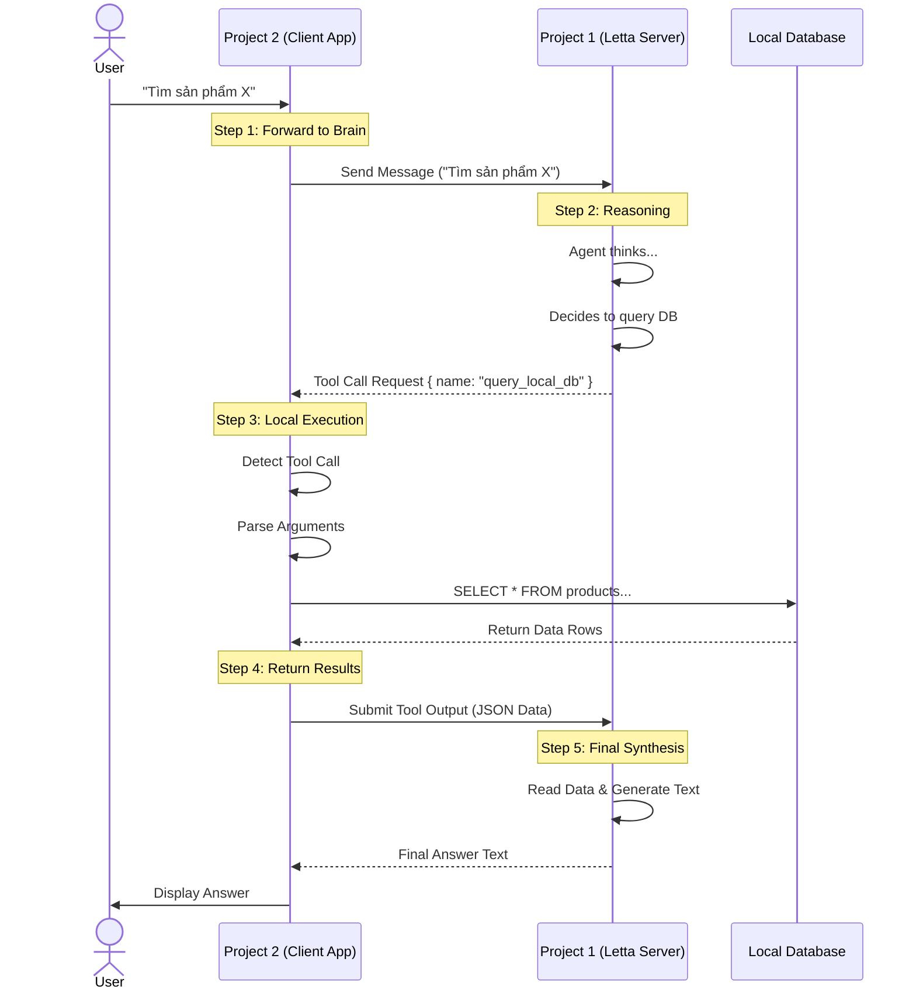

# Sequence Diagram

## Full Interaction Flow

Interaction giữa User -> Client App -> Letta Server -> Database.

```mermaid
sequenceDiagram
    actor User
    participant Client as Project 2 (Client App)
    participant Server as Project 1 (Letta Server)
    participant DB as Local Database

    User->>Client: "Tìm sản phẩm X"
    
    Note over Client: Step 1: Forward to Brain
    Client->>Server: Send Message ("Tìm sản phẩm X")
    
    Note over Server: Step 2: Reasoning
    Server->>Server: Agent thinks...
    Server->>Server: Decides to query DB
    Server-->>Client: Tool Call Request { name: "query_local_db" }
    
    Note over Client: Step 3: Local Execution
    Client->>Client: Detect Tool Call
    Client->>Client: Parse Arguments
    Client->>DB: SELECT * FROM products...
    DB-->>Client: Return Data Rows
    
    Note over Client: Step 4: Return Results
    Client->>Server: Submit Tool Output (JSON Data)
    
    Note over Server: Step 5: Final Synthesis
    Server->>Server: Read Data & Generate Text
    Server-->>Client: Final Answer Text
    
    Client->>User: Display Answer
```
