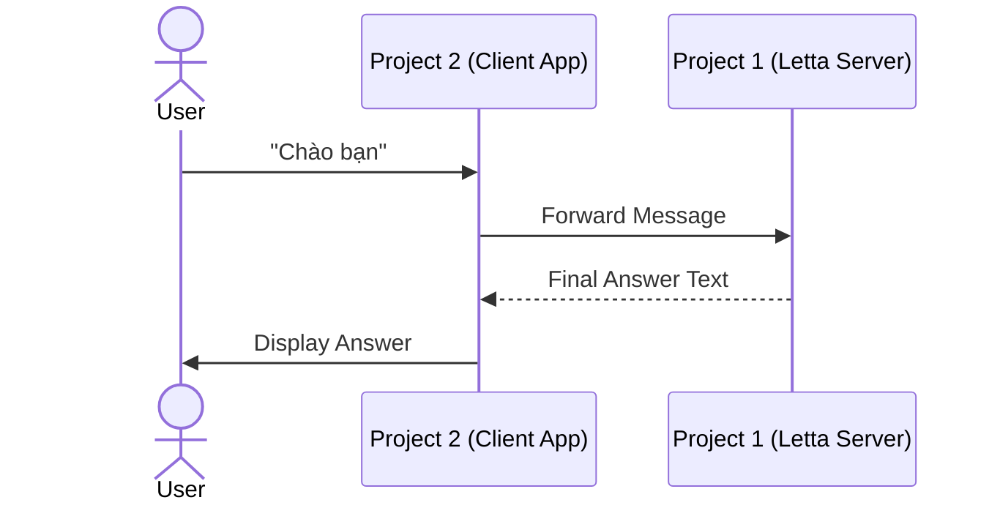
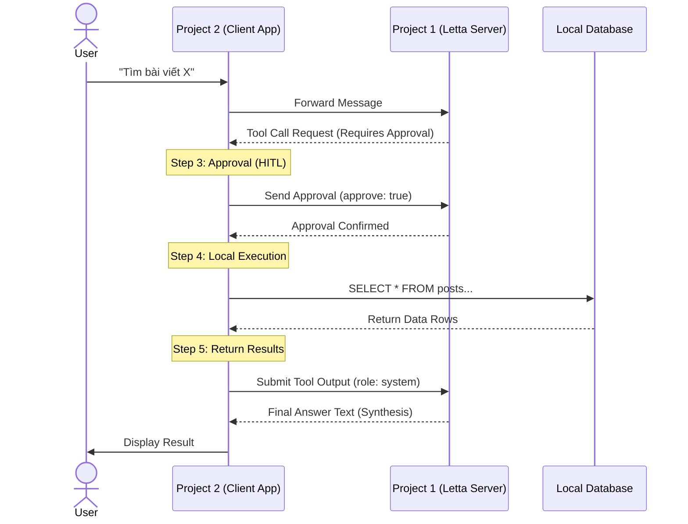
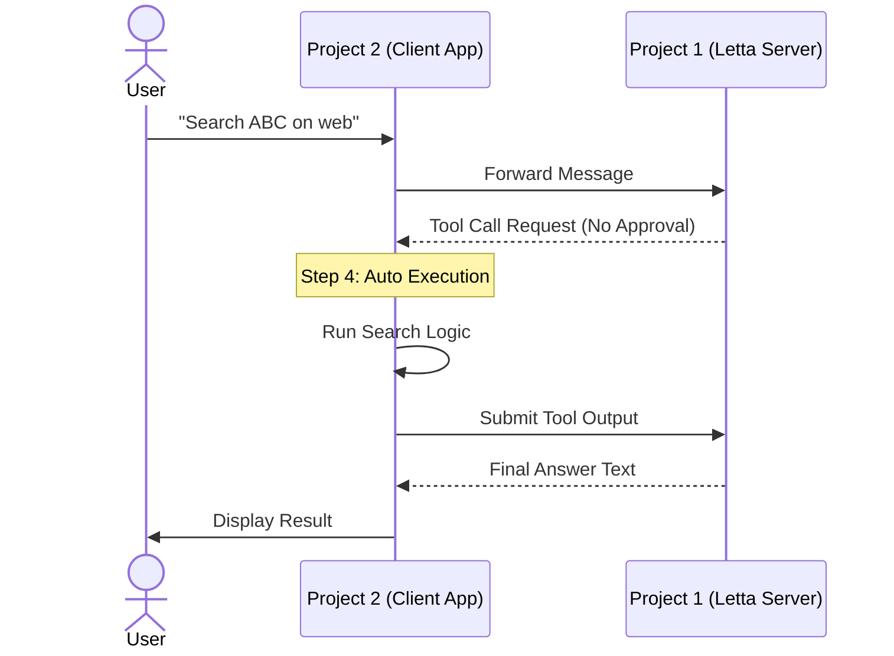

# Sequence Diagram

## 1. Luồng Chat cơ bản (Simple Chat)

```mermaid
sequenceDiagram
    actor User
    participant Client as Project 2 (Client App)
    participant Server as Project 1 (Letta Server)

    User->>Client: "Chào bạn"
    Client->>Server: Forward Message
    Server-->>Client: Final Answer Text
    Client->>User: Display Answer
```

## 2. Luồng Gọi Tool có xác nhận (HITL Flow)

```mermaid
sequenceDiagram
    actor User
    participant Client as Project 2 (Client App)
    participant Server as Project 1 (Letta Server)
    participant DB as Local Database

    User->>Client: "Tìm bài viết X"
    Client->>Server: Forward Message
    
    Server-->>Client: Tool Call Request (Requires Approval)
    
    Note over Client: Step 3: Approval (HITL)
    Client->>Server: Send Approval (approve: true)
    Server-->>Client: Approval Confirmed
    
    Note over Client: Step 4: Local Execution
    Client->>DB: SELECT * FROM posts...
    DB-->>Client: Return Data Rows
    
    Note over Client: Step 5: Return Results
    Client->>Server: Submit Tool Output (role: system)
    
    Server-->>Client: Final Answer Text (Synthesis)
    Client->>User: Display Result
```

## 3. Luồng Gọi Tool tự động (Auto-execution)

```mermaid
sequenceDiagram
    actor User
    participant Client as Project 2 (Client App)
    participant Server as Project 1 (Letta Server)

    User->>Client: "Search ABC on web"
    Client->>Server: Forward Message
    
    Server-->>Client: Tool Call Request (No Approval)
    
    Note over Client: Step 4: Auto Execution
    Client->>Client: Run Search Logic
    
    Client->>Server: Submit Tool Output
    
    Server-->>Client: Final Answer Text
    Client->>User: Display Result
```
